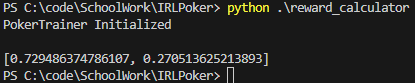
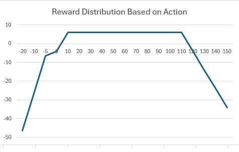

# Inverse Reinforcement Learning for Poker

## Introduction

### Motivation

Reinforcement learning has been successfully applied to many games that have consistent behaviour where the information is complete. It has also been applied to control problems without full information of the environment, however something it tends to not be good at is figuring out rewards that do not directly impact the reward, however could impact the reward.

This concept is similar to the incentives given in Montezumas Revenge to handle spaces with sparse rewards. In games of incomplete information however, there can be intrinsic information, which if learned would significantly increase the performance of the agent. As a simple example, if the agent could somehow peek at its opponents cards in a game like poker, it would be able to give much better decisions.

However loss of the main reward makes its very hard for the algorithms to learn secondary objective functions. Therefore there can be value in having the predictions be multimodal, and optimize the network not just around the primary objective function, but also secondary functions like information. However it is not clear how the primary and secondary objective functions should bbe weighted when training the network, if secondary function is given too much weight, the agent can just learn a bad policy where it always tries to get information regardless of its cost.

A way of figuring out what we should be using as a reward function for these algorithms can be to look at expert data, and comparing the rewards of agents actions, and trying to push the agent to give decisions that maximizes the same reward that would maximize the experts actions.

## Implementation

### Proposed Algorithm

1. Create the environment that executes the actions and returns state action reward triplets.
2. Initialize the Reward function to a naive reward function
3. Train an Agent using Actor Critic, save the Critic
4. Feed the states where the Expert has chosen actions to the Actor, and sample actions.
5. Calculate the corresponding predicted reward values using the critic.
6. Generate a new Reward function that maximizes $\sum_{s \in S} R(E(s)) - R(A(s))$ where E(s) is the Expert action for the state and A(s) is the actor action for the state.
7. If the newly generated Reward function is not close to the old reward function, go back to step 2 and reiterate.

### Intuition

The idea of the algorithm is that the reward for a state is dependent on the environment. And in a game with multiple players, the agents that emulate the other players are inherently a part of the environment. Therefore if we change the reward function and retrain the agents based on the new reward function, the reward predicting critic needs to be retrained as well considering the changes in the actors. 

### Implementation of Reward Function Calculator

To calculate the new reward function we take dataset of expert actions and extract the rewards associated with them. 

We then take the agent and sample 25 actions from the agent in the state expert took its action. So for each expert state action pair, we get 25 correspoding state action pairs from the agent. 

We then figure out the rewards for each action of the agent using the critic model.

We pair each reward that the agent got, with the reward of the expert, and set up Advantage of the expert Adv = a * ($ExpReward^2$ - $AgentReward^2$).

Lastly we do linear programming to maximize Adv with the variables in vector a. Then the reward function normalized based on l1 norm.

### Implementation of Agent with Actor-Critic

1. Initialize Actor and Critic Networks.
2. With the Actor, sample actions in the environment.
3. Save the state action reward triplets into a buffer.
4. Sample state action reward triplets from the buffer.
5. Predict the reward given state and action. Backpropogate based on the guess, and the real reward.
6. Predict an action given the state using the Actor network. Backpropogate on the action chosen based on the Q value.
7. Resample new points using the updated actor and go back to step 3.

## Issues with Implementation

### Continious action space

We need to be able to sample any action since the human actions in the dataset are continious. We cannot estimate values around their actions if we have an action space of limited size (4/5/6) like a lot of other trainers use for problems of this kind. This means that the implmentation of the environment needs to be flexible such that we can get data instead of calling everything an illegal move.

This concept creates many problems with training:

1. State space was too large. In a game of 4 players, there are a total of 13 cards that are given to players chosen from 52 cards. To make the matters worse, the state space is completely discrete, unlike visual domains where close states show similar behavior, a card being different can completely change the outcome of the game.
2. Going all in become very good strategy for early agents, because if the agent was not going all in, it could not match other agents going all in
3. If we include negative rewards to avoid illegal moves, the agent started learning if it folds all the time it can avoid negative rewards.
4. The above two conditions combined with standard deviation during the prediction caused the mean of the action to blow up either in positive or negative direction, as the agent wanted to predit 0 or all in.
5. Adding artificial constraints caused unintended albeit good strategies. In particular, explicitly banning all ins, changes the game to a forced all in game. 
6. Actor was highly reliant on the Critic, as if the critic predictions were not good, the actor would be optimizing against wrong values. The initialization of critic predicting 0 for most cases (despite the loss potentially being really high) meant that actor was thrown to a flat gradient space with bad performance very often.
7. Once the actor updates, its predictions will be very different than what the critic had previously seen. This becomes problematic for convergence reasons as the critic always is optimized based on the data from the previous actor.
8. Most trajectories are meaningless, it is hard to find good data while training.
9. Using generic Q iteration is not really possible because we care for the values we get from the critic with respect to the real rewards we observe both from the environment and the expert dataset.

### Issues with State space

As mentioned above state space was very large. This maent that it was impossible to get a meaningful sample without using a lot of resources. To combat this, we have simplified the game by removing a suit as well as removing two of the players. This meant that we could not run the algorithm we initially intended as the dataset we had for human poker hands included up to 9 seats, with a full deck, which we would need millions of samples per sampling round to have any chance of making a good critic for.

### Issues with Action space

Designing the action space was non-trivial. A portion of what the action space meant was baked into the engine we used to simulate the game. However exactly how the action space would be conveyed to the game engine would substantially change the behaviour of the underlying agent. As an example, spreading the action space such that it is hard to call all in would make it so the agent would highly value high bets, even if the hand was not good.

### Most samples containing too little information

This is another issues that we faced where the Actor would be likely to be very set on all inning because for a player with no information it is the highest expected value play. In particular, an all in would have the expected value of 0, whereas a fold would have an expected value of either -2 or -4, meaning that before the relationships of the cards are learned, only trajectory that is sampled are all ins. 

Best strategy being all in for an extended period of time put large upward pressure to the predicted action, causing the predictions to go towards infinity before any card informations could be learned.

### Banning All ins is impossible

This was an unexpected issue that we got, however seeing it was quite magical. All in is a move in poker that guarantees that one can play in a hand even from a money disadvantage. The issue with banning all in actions in any way is that the actors quickly learned that if they at any point had money advantage, they could repeatedly make aggressive bets, and put the opposition to a situation where they could not accept the bid amount without going all in. So any agent with a money disadvantage would be forced to concede everything. Because of this starting from first hand, both actors would repeatedly bet at fisrt round. 

We have observed this style of gameplay when we played against the agent ourselves under the no all in rules, waited fora  good hand to play, just to be put in a position where we were forced to concede the hand due to the added restrictions.

### Rewards should be designed to guide gradients

As mentioned above we had to ensure that agents had some cushion to ensure the game did not become a game of chicken against the all in amount. However allowing actions to go below 0, and above the total amount of money, and considering them legal bets created rewards to be comepletely flat beyond those points, so the algorithms would not get gradients because change in the action would not affect the rewards. Therefore we needed to add punishment to values that were not within the [0-MaxMoney] range, we added negative rewards that had gradients that would guide the actor towards the correct range.

